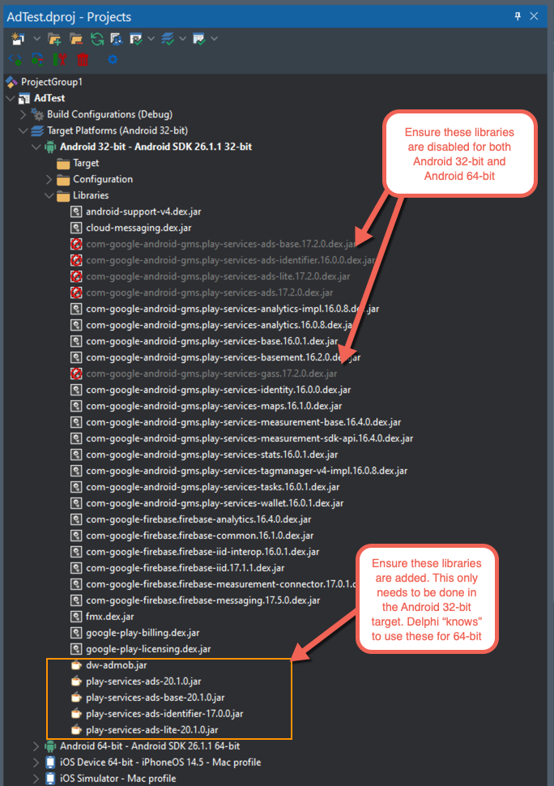

# AdMob test project

## Purpose

To display ads :-)

## Description

Advertising implementation, specifically for AdMob (at present)

## Project Configuration

### Component

**Please install the TAdMobBannerAd component first** (before even loading the demo)

The package can be found [here](https://github.com/DelphiWorlds/Playground/tree/main/Packages/D110) 

### Libraries

If creating your own project, you will need to add the [`dw-admob.jar`](https://github.com/DelphiWorlds/Playground/blob/master/Lib/dw-admob.jar) file to the Libraries node under the Android platform in Project Manager

When using Delphi 10.4.x, you will need to add other libraries and disable some default libraries, as per this screenshot:

### Android Entitlements

Ensure your project has the `AdMob Service` enabled. This adds Google Play services metadata and the Ads activity to the manifest.

### Android Permission

Ensure your project has the `Access Network State` permission in Project Options

## Feedback

Please provide feedback about this demo as per [the main ReadMe.](https://github.com/DelphiWorlds/Playground/blob/main/Readme.md)

## Status

June 22nd, 2022

Implemented so far (Android and iOS):

* TAdMobBannerAd:  [Banner Ad](https://developers.google.com/admob/android/banner)  - very basic testing has been performed
* TAppOpenAd: [App Open Ad](https://developers.google.com/admob/android/app-open) - basic testing
* TInterstitialAd: [Interstitial Ad](https://developers.google.com/admob/android/interstitial) - basic testing
* TRewardedAd: [Rewarded Ad](https://developers.google.com/admob/android/rewarded) - basic testing
* TRewardedInterstitialAd: [Rewarded Interstitial Ad] - basic testing

**NOTE: Thanks to some prodding from Chris Pimlott of MyBuzz Technologies, the events issue on iOS has been resolved**

Chris has also contributed a change to TAdMobBannerAd to support adaptive ad sizes, so please give that a test

A [package has been created for Delphi 10.4.x](https://github.com/DelphiWorlds/Playground/tree/main/Packages/D104), as well as a [demo](https://github.com/DelphiWorlds/Playground/tree/main/Demos/AdMob/D104). Only RewardedAd has had very basic testing. **It is possible that something else might be broken, as some jars needed to be disabled.**

