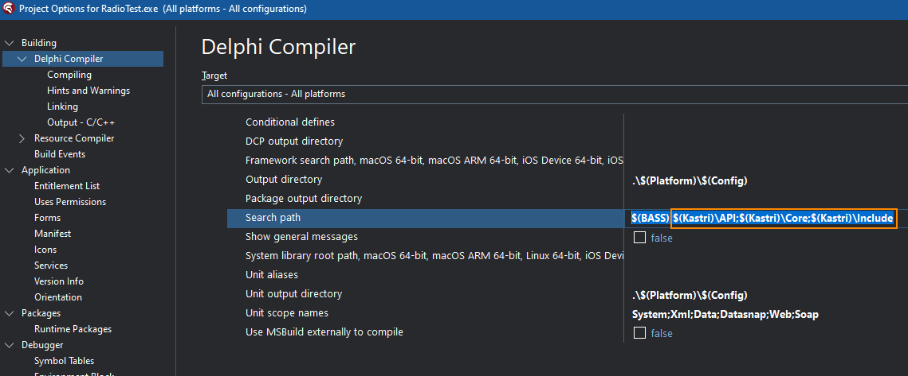
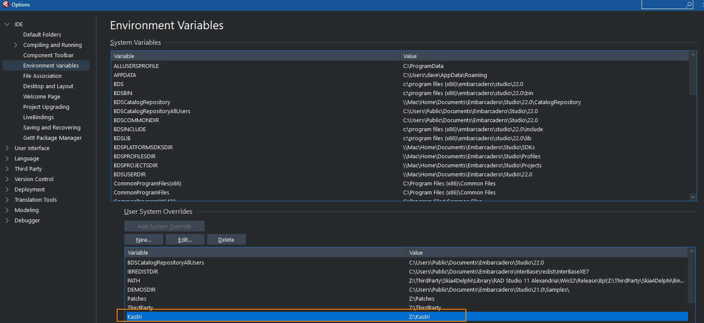

# Playground

## Description

A collection of demos and code that I'm working on that I have chosen to make public, usually associated with the [Kastri library](https://github.com/DelphiWorlds/Kastri).

**The code presented here may or may not make it into the Kastri library, depending on the success of the code here, and how many find the code useful**

Compatible with [Embarcadero](https://wwww.embarcadero.com) [Delphi](https://www.embarcadero.com/products/delphi)

From [Delphi Worlds](https://www.delphiworlds.com):

    

## Project configuration

Some of the demos in Playground rely on the [Kastri repo](https://github.com/DelphiWorlds/Kastri). The projects for these demos will have search paths to the Kastri source, e.g:

Note how the search paths make use of a macro: `$(Kastri)`. This macro can be defined in the User System Overrides of the Environment Variables section of the IDE Options, e.g:

To add an override, click the New button, enter Kastri for the name, select the folder where you have downloaded the Kastri repo to, and click OK.

If you do not want to add an override, you will need to replace `$(Kastri)` with the path where you have Kastri.

## Communicating problems and/or suggestions

### Issues page

If you encounter an issue, or want to make a suggestion, please [visit the issues page](https://github.com/DelphiWorlds/Playground/issues) to report it.

### Slack Channel

The Delphi Worlds Slack workspace has a channel (#kastri) devoted to discussing Kastri, however this channel can also be used to discuss Playground topics.

If you would like to join the Delphi Worlds Slack workspace, [please visit this self-invite link](https://slack.delphiworlds.com)

## License

How To is licensed under MIT, and the license file is included in this folder.

